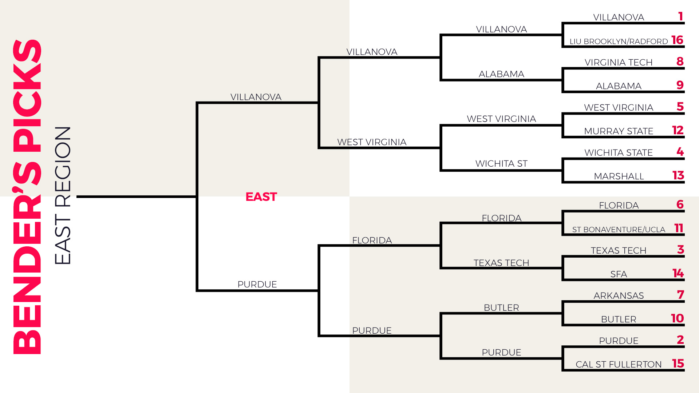

#### Dataset source: https://data.world/sports/ncaa-mens-march-madness

### Problem:
We want to create a model to determine the winner of a March Madness 
game, given the matchup and seeding.

<p>March Madness is broken up into 4 regions, each with 16 teams, seeded
1 through 16. Every first matchup is the same. Then, the winner of 
each region then moves on to play in semifinals. 
The winners of those games plays in the championship game. A single region
is pictured below:</p>

#

```{r}

library(tidyr)
library(dplyr)
library(aod)
library(ggplot2)
library(caret)
library(e1071)
library(lubridate)
library(RSQLite)
library(cowplot)
library(randomForest)

# Import the dataset showing tournament results. Our data contains 
# the winners and losers of the tournament from 1985 to 2016, along with
# the winner's and loser's seeding. We must include every game to get
# a true representation (no outliers, since seed numbers are always 1-16)

tournamentData <- read.csv("NCAA Mens March Madness Historical Results.csv")

tournamentData$Date <- as.Date(tournamentData$Date, '%m/%d/%Y')

tournamentData$Year <- year(tournamentData$Date)


# Since we want to predict the winning seed, we have to make new data derived
# from our data set, since Winning seed and losing seed is only determined once 
# a game has already taken place. So, we add HigherSeed and LowerSeed 
# columns to represent the higher and lower seed matchup for each game, which
# is determined before the start of the game. We do the same for each team,
# since we do not know the winner and the loser before the start of the game.
# So new columns are added representing the favorited and unfavorited teams
# based off seeding. 
tournamentData$HigherSeed[tournamentData$Winning.Seed > tournamentData$Losing.Seed] <- 
  tournamentData$Losing.Seed[tournamentData$Winning.Seed > tournamentData$Losing.Seed]

tournamentData$HigherSeed[tournamentData$Winning.Seed < tournamentData$Losing.Seed] <- 
  tournamentData$Winning.Seed[tournamentData$Winning.Seed < tournamentData$Losing.Seed]

tournamentData$HigherSeed[tournamentData$Winning.Seed == tournamentData$Losing.Seed] <- 
  tournamentData$Winning.Seed[tournamentData$Winning.Seed == tournamentData$Losing.Seed]

tournamentData$LowerSeed[tournamentData$Winning.Seed > tournamentData$Losing.Seed] <- 
  tournamentData$Winning.Seed[tournamentData$Winning.Seed > tournamentData$Losing.Seed]

tournamentData$LowerSeed[tournamentData$Winning.Seed < tournamentData$Losing.Seed] <- 
  tournamentData$Losing.Seed[tournamentData$Winning.Seed < tournamentData$Losing.Seed]

tournamentData$LowerSeed[tournamentData$Winning.Seed == tournamentData$Losing.Seed] <- 
  tournamentData$Winning.Seed[tournamentData$Winning.Seed == tournamentData$Losing.Seed]

tournamentData$FavoritedTeam[tournamentData$Winning.Seed < tournamentData$Losing.Seed] <-
  as.character(tournamentData$Winner[tournamentData$Winning.Seed < tournamentData$Losing.Seed])

tournamentData$FavoritedTeam[tournamentData$Winning.Seed > tournamentData$Losing.Seed] <-
  as.character(tournamentData$Loser[tournamentData$Winning.Seed > tournamentData$Losing.Seed])

tournamentData$FavoritedTeam[tournamentData$Winning.Seed == tournamentData$Losing.Seed] <- 
  as.character(tournamentData$Winner[tournamentData$Winning.Seed == tournamentData$Losing.Seed])

tournamentData$UnfavoritedTeam[tournamentData$Winning.Seed == tournamentData$Losing.Seed] <- 
  as.character(tournamentData$Loser[tournamentData$Winning.Seed == tournamentData$Losing.Seed])

tournamentData$UnfavoritedTeam[tournamentData$Winning.Seed > tournamentData$Losing.Seed] <-
  as.character(tournamentData$Winner[tournamentData$Winning.Seed > tournamentData$Losing.Seed])

tournamentData$UnfavoritedTeam[tournamentData$Winning.Seed < tournamentData$Losing.Seed] <-
  as.character(tournamentData$Loser[tournamentData$Winning.Seed < tournamentData$Losing.Seed])

# We do not need overtime, or scores, because we are looking at the matchup
# before the result is determined. So having the scores of the game after the 
# fact are not needed, as well as if the game went into overtime. Remove these 
# columns from the data set.

tournamentData$Winning.Score <- NULL
tournamentData$Losing.Score <- NULL
tournamentData$Overtime <- NULL

# Create column showing whether match resulted in upset or not; an upset
# is defined as the winning seed being at least 3 seeds lower than the
# losing seed (i.e. a 10 seed beating a 7 seed, or a 10 seed beating a 1 seed)
# If seeds are not at least 3 apart in distance (i.e. 9 seed beating 8 seed)
# it is not considered an upset.
tournamentData$isUpset[tournamentData$Winning.Seed - tournamentData$Losing.Seed >= 3] <- 1
tournamentData$isUpset[tournamentData$Winning.Seed - tournamentData$Losing.Seed < 3] <- 0


```

```{r}
# Put the table we created into a SQLite database
db <- dbConnect(RSQLite::SQLite(), 
                     "marchMadnessData.sqlite")

dbWriteTable(db, "marchMadnessData", tournamentData, overwrite = TRUE)
```

```{r}

# SQL query for getting the number of times each seed has won / lost
# its respective game. This information is then stored in a data frame,
# which is returned by the function.

getFreqTable <- function(x) {
  
  # Function runs query on dataset. Complex join query, since
  # SQLite does not support full outer join.
  
  result <- data.frame(dbGetQuery(db, paste("with winningSeedFreq(seed, winFreq) as
(select [Winning.Seed], count([Winning.Seed])
           from marchMadnessData
           where (Round = '", x, "')
           group by [Winning.Seed]),
           losingSeedFreq(seed, loseFreq) as
           (select [Losing.Seed], count([Losing.Seed])
           from marchMadnessData
           where (Round = '", x, "')
           group by [Losing.Seed])
           
           SELECT winningSeedFreq.Seed, winningSeedFreq.winFreq, losingSeedFreq.loseFreq
            FROM winningSeedFreq
           LEFT JOIN losingSeedFreq USING(seed)
           UNION ALL
           SELECT losingSeedFreq.Seed, winningSeedFreq.winFreq, losingSeedFreq.loseFreq 
           FROM losingSeedFreq 
           LEFT JOIN winningSeedFreq USING(seed)
           WHERE winningSeedFreq.seed IS NULL;", sep = "")))
  
  result$seed <- as.numeric(result$seed)
  result$winFreq <- as.numeric(result$winFreq)
  result$loseFreq <- as.numeric(result$loseFreq)
  
  # Simple solution for handling NA in data. This simply means there is a
  # null value returned by the joining of the tables, so this will be a zero
  # since the value would be returned if there were any wins/losses. 
  result[is.na(result)] <- 0
  result[order(result$seed),]
}

roundOf64 <- getFreqTable("Round of 64")

roundOf32 <- getFreqTable("Round of 32")

roundOf16 <- getFreqTable("Sweet Sixteen")

eliteEight <- getFreqTable("Elite Eight")

finalFour <- getFreqTable("National Semifinals")

championship <- getFreqTable("National Championship")


# This function will help us visualize the number of times 
# each seed number has lost / won its respective game. We expect 
# the higher seeds to have won more games than the lower seeds.
plotFrequencies <- function(x, title) {
  result <-
  data.frame(c(x$seed, x$seed), c(rep("# of wins", length(x$seed)),
  rep("# of losses", length(x$seed))),
  c(x$winFreq, x$loseFreq))
  
  colnames(result) <- c("Seed", "FrequencyType", "Count")
  
  ggplot(result, aes(x = Seed, y = Count, fill = FrequencyType)) + 
    geom_bar(position = position_dodge2(reverse = TRUE), stat = "identity") +  
    scale_x_discrete("Seed",
  labels = as.character(result$Seed),
  limits = result$Seed) + ggtitle(title)
}

# Show frequency of how often an upset occurs
upsetsDf <- as.data.frame(table(tournamentData$isUpset))
colnames(upsetsDf) <- c("IsUpset", "Frequency")
ggplot(upsetsDf, aes(x=IsUpset, y = Frequency, label = Frequency)) + 
  geom_bar(stat="identity", fill = "Red") + 
  ggtitle("Frequency of Upsets") +
  geom_text(position = position_stack(vjust = .5)) 

plotFrequencies(roundOf64, "Round of 64 Win and Loss Frequencies by Seed")
plotFrequencies(roundOf32, "Round of 32 Win and Loss Frequencies by Seed")
plotFrequencies(roundOf16, "Round of 16 Win and Loss Frequencies by Seed")
plotFrequencies(eliteEight, "Round of 8 Win and Loss Frequencies by Seed")
plotFrequencies(finalFour, "Semifinals Win and Loss Frequencies by Seed")
plotFrequencies(championship, "Championship Win and Loss Frequencies by Seed")

```
```{r}

# Set all columns regarding seeding to factors with levels 1-16
tournamentData$Winning.Seed <- as.factor(tournamentData$Winning.Seed)
levels(tournamentData$Winning.Seed) <- 
  c(1, 2, 3, 4, 5, 6, 7, 8, 9, 10, 11, 12, 13, 14, 15, 16)

tournamentData$HigherSeed <- as.factor(tournamentData$HigherSeed)
levels(tournamentData$HigherSeed) <- 
  c(1, 2, 3, 4, 5, 6, 7, 8, 9, 10, 11, 12, 13, 14, 15, 16)

tournamentData$Losing.Seed <- as.factor(tournamentData$Losing.Seed)
levels(tournamentData$Losing.Seed) <- 
  c(1, 2, 3, 4, 5, 6, 7, 8, 9, 10, 11, 12, 13, 14, 15, 16)

tournamentData$LowerSeed <- as.factor(tournamentData$LowerSeed)
levels(tournamentData$LowerSeed) <- 
  c(1, 2, 3, 4, 5, 6, 7, 8, 9, 10, 11, 12, 13, 14, 15, 16)

# Split data into 70% training data set and 30% test data set.
# Model will be built with training_data, and the 
# test_data will test the model's accuracy.
training_data <- tournamentData %>% sample_frac(0.7)
test_data <- setdiff(tournamentData, training_data)


```

```{r}
# We will use naive bayes to create our model. Since we want to predict 
# the winning seed, we cannot use any of the data involving who the winner /
# loser is, since that is determined after the match has ended. 
# Let's try the following two variables and evaulate the model:
# HigherSeed and LowerSeed
bballModel <- naiveBayes(Winning.Seed ~ HigherSeed + LowerSeed, 
                         data = training_data)

prediction <- predict(bballModel, test_data)

modelMatrix <- confusionMatrix(prediction, test_data$Winning.Seed)

modelMatrix #ConfusionMatrix used for measuring accuracy
```


```{r}

# Let's try adding teams, and see if that gives us a stronger accuracy
# for the model.
bballModel <- naiveBayes(Winning.Seed ~ HigherSeed + LowerSeed + FavoritedTeam
                         + UnfavoritedTeam, 
                         data = training_data)

prediction <- predict(bballModel, test_data)

modelMatrix <- confusionMatrix(prediction, test_data$Winning.Seed)

modelMatrix
```
```{r}
# Finally, let's add region and round into the mix. All variables
# added are independent, so this will fit into naive bayes.

bballModel <- naiveBayes(Winning.Seed ~ HigherSeed + LowerSeed + FavoritedTeam
                         + UnfavoritedTeam + Round + Region, 
                         data = training_data)

prediction <- predict(bballModel, test_data)

modelMatrix <- confusionMatrix(prediction, test_data$Winning.Seed)

modelMatrix
```

<p> Looking at Sensitivity for each class, we see that it decreases with each 
lower seed. True positive rating is between 70 - 80% for most classes.</p>

```{r}

# Create a random forest model to see if this gives better results 
# than naive bayes. If it is a better fitting model for the data, the 
# confusion matrix will have a higher accuracy. 

rf_model <- randomForest(Winning.Seed ~ HigherSeed + LowerSeed + Round +
                           Region, data = training_data, importance = TRUE, ntree = 1000)
rf_model 
varImpPlot(rf_model)

rf_prediction <- predict(rf_model, test_data)
confusionMatrix(test_data$Winning.Seed, rf_prediction)
```

<p>Based off of the higher accuracy of the naive bayes model via the confusion
matrix, we determine 
that the naive bayes model performs better than the random forest model. 
However, creating the second model was necessary to determine that we had the
right model in naive bayes, and it also shows us that higherSeed and LowerSeed
are the most important variables in the model.</p>

### Model Evaluation and Conclusion:
Our naive bayes model is about 75-80% accurate. By using our model to make your
bracket, you have about a 75% chance to get any individual game to result in 
a correct 
outcome. There are limitations to this model, one of which being if two 
teams of the same seeding (i.e. a 1 seed vs a 1 seed) face off in the semifinals
or finals. To improve on the concept of predicting a winner for the match, a 
future model could be constructed that gives the winning team instead of the 
winning seed number. Also, you can incorporate season stats for a team to 
make an even stronger model, since season stats indicate a lot about a team's 
performance. To conclude, I would determine that this model is not strong enough
to make an ideal bracket, but can be used as a supplement if the user needs 
assistance in a match by match basis.
